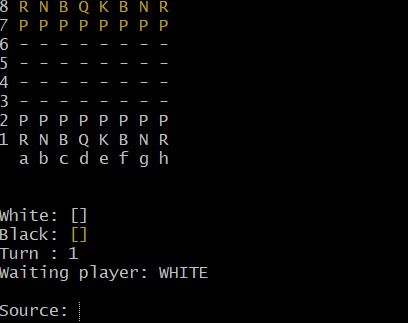

# Chess-System 
[](https://github.com/Lucas-iferreira/workshop-springboot3-jpa/blob/main/LICENSE) 

# Sobre o projeto

Este projeto consiste em um sistema de xadrez desenvolvido em Java, totalmente baseado em console, com foco no uso de Programação Orientada a Objetos (POO). O principal objetivo é consolidar os fundamentos da linguagem Java aplicando conceitos como herança, polimorfismo, encapsulamento e composição.

A aplicação simula uma partida completa de xadrez entre dois jogadores, respeitando as regras oficiais do jogo. Além dos movimentos tradicionais, o sistema também implementa movimentos especiais como roque, en passant e promoção de peão, além da detecção de xeque e xeque-mate.

Foi desenvolvido como parte prática do curso "Java COMPLETO" do professor Nélio Alves, e serve como um excelente exercício para quem deseja aprofundar seus conhecimentos em Java e entender como modelar problemas reais com orientação a objetos.

# Conceitos aplicados
- Encapsulamento
- Herança
- Polimorfismo
- Abstração
- Enums
- Associações entre Objetos
- Tratamento de Exceções
- Padrão de Camadas​
  
## Modelo conceitual


## Modelo console


# Tecnologias utilizadas

- Java SE
- Estruturas de Dados (Listas, Matrizes)
- Programação Orientada a Objetos
- Tratamento de Exceções

# Funcionalidade

- Movimentação de peças conforme as regras do xadrez
- Verificação de xeque e xeque-mate
- Implementação de movimentos especiais: roque, en passant e promoção
- Interface de texto no console para interação com o usuário

# Como executar o projeto

Pré-requisitos: Java 17

```bash
# clonar repositório
git clone https://github.com/Lucas-iferreira/chess-system-java.git

# acessar a pasta pelo CMD / Git Bash
cd chess-system-java

# acessar a pasta de produção out
cd out\production\chess-system

# aplicar o seguinte comando para executar o programa
java application/Program
```

# Agradecimentos
Agradeço ao professor [Nelio Alves](https://www.linkedin.com/in/nelio-alves/) pelo projeto realizado junto ao seu curso da Udemy, que me proporcionou ganhos de conhecimentos notáveis em JAVA.

# Autor

Lucas Ferreira

https://www.linkedin.com/in/lucas-iferreira/
